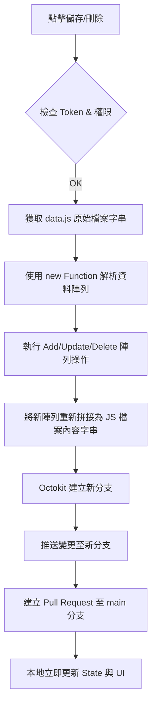

# 開發與維護指南 (Development & Maintenance Guide)

本文件旨在幫助開發者深入理解「新加坡飯店挑選助手」的程式架構、核心功能實作方式，以及如何有效地擴充功能或進行日常維護。

## 1. 專案結構 (Project Structure)

### 1.1 目錄樹狀圖
```text
.
├── index.html          # 應用程式主入口與 UI 結構
├── style.css           # 自定義樣式與 Tailwind 擴充
├── script.js           # 核心邏輯 (State, Service, UI 渲染)
├── data.js             # 飯店資料庫 (格式化導出的 JS 陣列)
├── docs/               # 相關文件
│   └── DEVELOPMENT.md  # 本開發者文件
└── icon.png            # 應用程式圖示
```

### 1.2 技術棧 (Tech Stack)
- **基礎**: HTML5, Vanilla JavaScript (ES6+), CSS3.
- **UI 樣式**: Tailwind CSS (CDN 下載).
- **地圖服務**: [Leaflet.js](https://leafletjs.org/) & [OpenStreetMap/CartoDB](https://carto.com/basemaps).
- **GitHub 互動**: [@octokit/core](https://github.com/octokit/core.js) (處理 PR).
- **其他依賴**: [js-cookie](https://github.com/js-cookie/js-cookie) (處理 Token 存儲).

---

## 2. 核心架構詳解 (Implementation Details)

本專案採用**模組化單一檔案架構**，為了提升維護性，`script.js` 被劃分為以下幾個邏輯區塊：

### 2.1 狀態管理 (State Management)
全域變數 `State` 物件集中管理執行時期的數據：
- `currentFilteredHotels`: 存放過濾後的飯店子集，是所有 UI 渲染的數據源。
- `coordsCache`: 存儲從 Nominatim 獲取的座標，減少 API 調用。
- `mrtStations`: 存放解析後的捷運站地理資訊。

### 2.2 過濾機制 (Filtering Engine)
過濾邏輯高度依赖 `CONFIG.ALL_TAGS` 與 `UI.filterHotels()`：
- **宣告式過濾**: 在 `CONFIG.ALL_TAGS` 定義一個標籤後，`UI.filterHotels()` 會自動循環該陣列，檢查對應的 `checkbox` 狀態。
- **正向邏輯**: 遵循「**True = 正面/良好**」原則。如果標籤被勾選，飯店資料中該屬性必須為 `true` 才會顯示。

### 2.3 GitHub 編輯自動化流 (PR Workflow)
這是專案最複雜的部分，透過 `GitHubService.createPR()` 實現：


---

## 3. 開發指引 (Expansion Guide)

### 3.1 如何新增一個過濾維度 (Filtering Tag)
假設要新增「是否有浴缸 (`hasBathtub`)」：
1.  **修改 `data.js`**: 為飯店新增 `hasBathtub: true` 或 `false`。
2.  **修改 `index.html`**: 在過濾器面板新增 `<input type="checkbox" id="bathtubFilter">`。
3.  **修改 `script.js`**: 在 `CONFIG.ALL_TAGS` 新增：
    ```javascript
    { key: 'hasBathtub', label: '有浴缸', filterId: 'bathtubFilter', type: 'amenity' }
    ```
4.  **自動化效益**: 系統會自動為卡片渲染「有浴缸」標籤，且過濾器會立即生效。

### 3.2 如何新增飯店屬性 (New Data Field)
若要新增不屬於標籤的資訊（如：飯店電話 `phone`）：
1.  **修改 `UI.openEditModal()`**: 在 Modal 中新增電話輸入欄位。
2.  **修改 `UI.submitPR()`**: 從 DOM 讀取電話值並加入 `data` 物件。
3.  **修改 `UI.renderList()`**: 在卡片範本中顯示電話。

### 3.3 自訂地圖彈窗 (Map Popup)
地圖彈窗內容位於 `MapService.updateMarkers()` 的 `content` 字串中。
- 若需調整彈窗樣式，可以直接修改該處的 HTML/Tailwind 類別。
- 捷運距離資訊也是在此處動態生成的。

---

## 4. 設計規範與維護準則 (Coding Standards)

為了確保多人協作與長期維護，請務必遵守：

### 4.1 命名與邏輯
- **True = 好事**: 命名要反映「優點」。
  - ✅ `isSoundproof` (隔音好)
  - ❌ `isNoisy` (噪音大)
- **CSS 類別**: 優先使用 Tailwind CSS 類別。若需自訂樣式，請定義在 `style.css` 並於 HTML 中調用。

### 4.2 資料更新
- **捷運資料**: 來源為外部 GeoJSON。若新加坡捷運有新線開通，可能需要調整 `CONFIG.MRT.NAME_COLORS` 與 `NAME_COLORS`。
- **資料庫更新**: `data.js` 必須保持 JS 語法格式，不可僅存為純 JSON。

### 4.3 異步處理
- 所有的 API 請求（Nominatim, GitHub）必須使用 `async/await` 配搭 `try...catch` 進行錯誤處理。
- 必須尊重 Nominatim 的 Rate Limit (`delay`)。

---
*此文檔最後更新日期: 2026-01-02*
*文件撰寫者: Antigravity*
